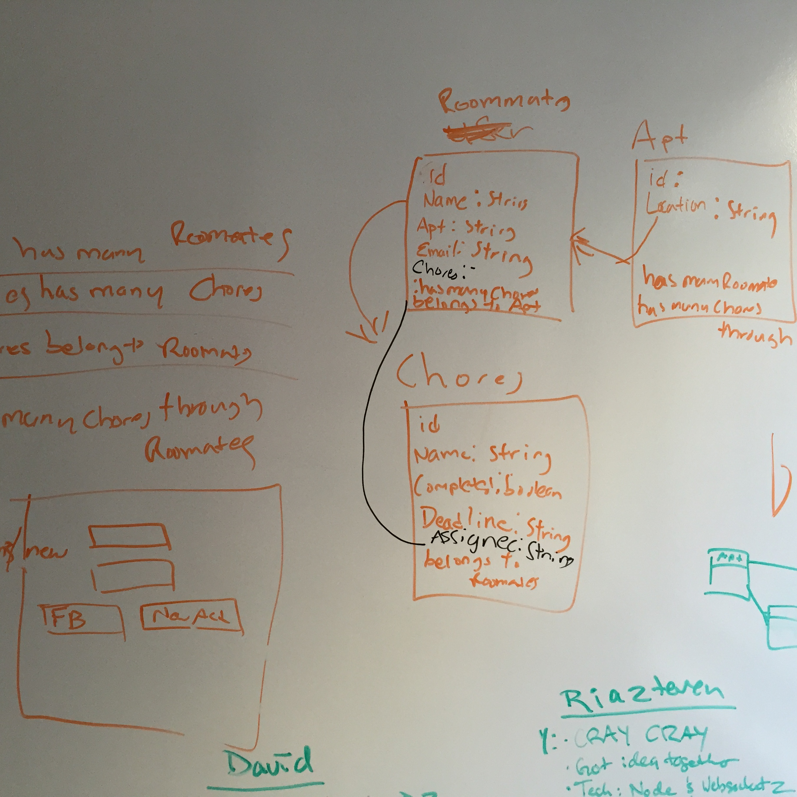
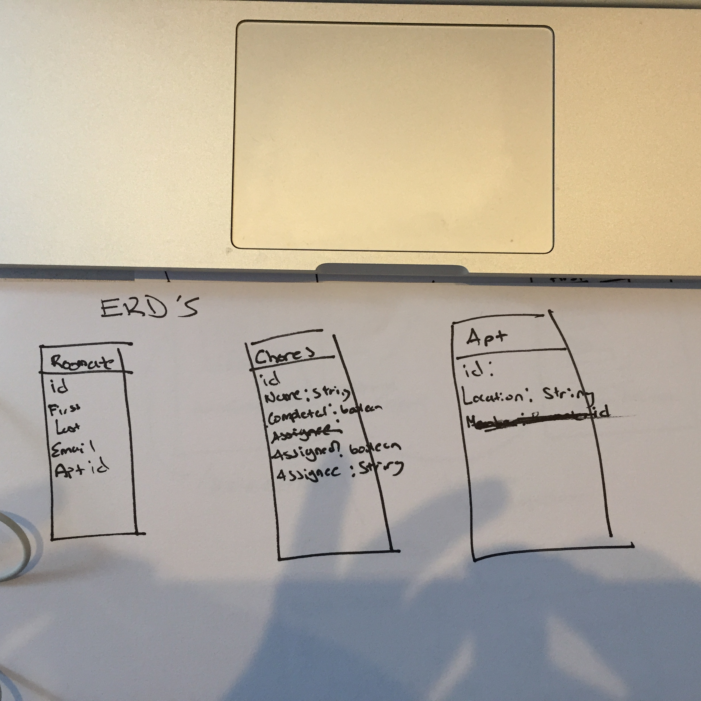

#Roommate Reminder App
Do you have roommates? Do you have to constantly remind them to do their chores?
This app is the one for you!

##Description
This app will enable anyone that lives in an apartment with roommates to invite them in and organize and divy typical chores that would need to be done in an apartment such as cleaning, buying general supplies etc.  Will be a rails backed app with some backbone on the Front-end

###Spec/User Stories
- Users will be able to create an account with email name and their address and apartment
- Users will then be able to see a list of chores available to them.  The apartment as a whole will have chores they can assign
to themselve or rooommmates
- A user can add a roommate to their apartment and when they do that person will get an email to join.
- A user can then assign any chores in the apartment to roommmates in that apartment

###ERD's

###
| HTTP Verb  | Path            | Controller#Action | Used for              |
| ---------- | --------------- | ----------------- | --------------------- |
| **Sessions**                                                             |
| Get        | /sessions/new   | sessions#new      | form for login        |
| Post       | /sessions       | sessions#create   | create session        |
| DELETE     | /sessions/:id   | sessions#destroy  | logout of session     |
